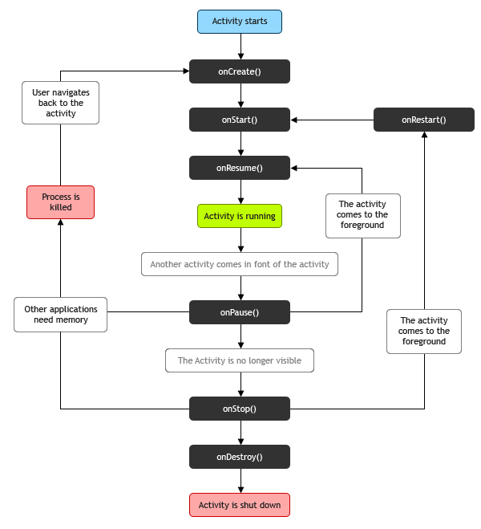

# Android Tech Interview

## 액티비티 생명 주기

A 액티비티 시작 -> A's `onCreate()` -> A's `onStart()` -> A's `onResume()` -> A 액티비티 실행

B 액티비티 실행되면, A's `onPause()` 호출.
A 액티비티가 화면상에서 보이지 않으면, A's `onStop()` 호출

A's `onPause()` 호출 후 A's `onStop()` 호출 이전 다시 A 액티비티가 화면상에 보이면 A's `onResume()` 호출과 함께 A 액티비티 실행
A's `onStop()` 호출 후 다시 A 액티비티가 화면상에서 보이면 A's `onRestart()` -> A's `onStart()` -> A's `onResume()` 호출과 함께 A 액티비티 실행

안드로이드 시스템 메모리 부족으로 A 액티비티를 종료 후 다시 A 액티비티를 시작하면 `onCreate()` 부터 다시 시작

finish() 메소드를 호출하거나 메모리 확보를 위해 액티비티를 제거할 때 `onDestroy()` 호출

> onStop()과 onDestroy()는 호출되지 않을 수 있음

