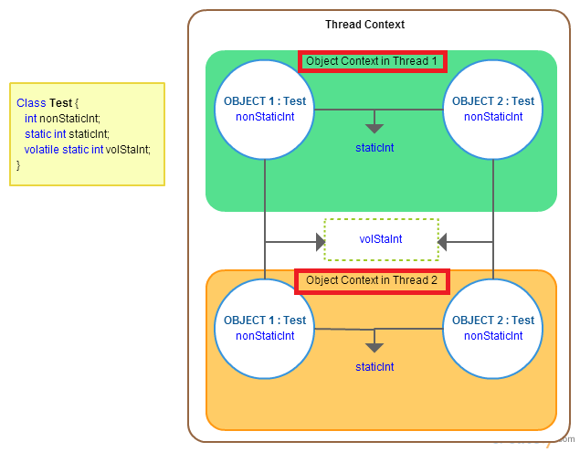

# Java Tech Interview

## Java Collection Framework


- Set : 데이터 중복을 허용하지 않고 순서가 없는 데이터의 집합
    - 구현클래스 : HashSet, TreeSet 등
- List : 데이터 중복을 허용하고 순서가 있는 데이터의 집합
    - 구현클래스 : ArrayList, LinkedList, Stack 등
- Map : 키(key)와 값(value) 쌍으로 이루어진 데이터의 집합, 키는 중복을 허용하지 않고 값을 중복을 허용
    - 구현클래스 : HashMap, TreeMap, HashTable 등
     
## 자바 기본형 정수와 Wrapper 클래스에 대한 차이는?
기본형 정수는 null이 불가능, Wrapper 클래스는 null 가능
Collection에서 기본형을 사용하려면 Wrapper 클래스를 사용해야 함

## 자바쓰레드 `start()`는 두번 호출 될 수 있는가?

될 수 없다. 두번 호출하면 IllegalThreadStateException() 이 발생한다.

## `static` 메소드를 오버라이드 할 수 있는가?

할 수 없다. JVM이 일반 메소드를 호출할 때 메소드 구현의 실체를 따라가 호출하지만 `static` 메소드를 호출할 경우 컴파일 시점에 선언된 타입을 호출하기 때문
 
## serialization 인터페이스에는 어떤 메소드가 있는가?
 
serialization 인터페이스는 메소드가 없다. 단지 직렬화 할 수 있다는 마커 인터페이스이기 때문

## `super()`와 `this()`의 차이?

`super()`는 super 클래스의 생성자를 호출, `this()`는 동일한 클래스의 생성자를 호출

## 메소드 overridden 방지법은 ?

메소드에 final 키워드를 선언하여 서브 클래스에 재정의를 막을 수 있음

## 컴포짓 패턴?

트리 구조를 만들 때, 리프 노드와 브런치 노드를 구분해서 구현했는데, 이는 더 복잡해지고 오류만 많아짐
이를 인터페이스로 추상화하여 일관되게 관리

## 자바의 메모리 구조에 대해 설명

프로그램 실행 -> JVM이 OS에서 메모리를 할당받아 실행 (Runtime Data Area)
- Class Area : 클래스 정보, Static 변수
- Stack Area : 메소드 호출마다 쌓이는 스택
- Heap Area : new 연산자로 생성되는 객체를 저장하는 공간, 가비지콜렉터를 통해 메모리 반환
- Native method Stack Area : 자바외에 다른 언어에서 제공되는 메소드가 저장되는 공간
- PC Register : Thread 생성마다 생성되는 공간, 현재 실행 중인 명령어와 주소를 저장

## NIO 란?

java 1.3까지는 blocking IO로 성능상 이슈가 컸음 -> java 1.4로 오면서 Nonblocking IO를 도입 성능 향상 (파일 입출력에 블록킹이 걸리지 않음) 

## DCL (Double-Checking Locking)

동시 접근시 락에 대한 오버헤드를 줄이기 위한 디자인 패턴 -> 싱글턴 패턴에서 사용

```java
// Single-threaded version
class Foo {
    private Helper helper;
    public Helper getHelper() {
        if (helper == null) {
            helper = new Helper();
        }
        return helper;
    }

    // other functions and members...
}
```

위 코드는 멀티쓰레드로 접근시 싱글턴을 지키지 못함 -> synchronized 키워드로 동기화 필요
 
```java
// Correct but possibly expensive multithreaded version
class Foo {
    private Helper helper;
    public synchronized Helper getHelper() {
        if (helper == null) {
            helper = new Helper();
        }
        return helper;
    }

    // other functions and members...
}
```

하지만 이렇게 할 경우, 싱글톤으로 단 하나의 인스턴스를 생성할 수 있으나 그 이후 몇몇 쓰레드에서 동시 접근시 불필요한 동기화를 함

```java
// Broken multithreaded version
// "Double-Checked Locking" idiom
class Foo {
    private Helper helper;
    public Helper getHelper() {
        if (helper == null) {
            synchronized(this) {
                if (helper == null) {
                    helper = new Helper();
                }
            }
        }
        return helper;
    }

    // other functions and members...
}
```

그래서 동기화 영역을 줄여 인스턴스 생성에만 동기화를 걸도록 만듬 

## Java volatile



멀티 코어, 쓰레드 환경에서 하나의 변수를 공유하기 위해 static 키워드를 사용하면 미묘하게 레이스 컨디션 문제가 발생함
이유는 static 변수를 각 코어 캐시에 복사해서 저장하기 때문임. 한 쓰레드가 해당 변수를 수정 할 때, 다른 코어 캐시에 변경 내역이 플러시 되기 전까지 다른 코어의 쓰레드는 수정사항을 알 수 없음

그래서 volatile 키워드를 통해 변수를 캐시 복사하지 않고 메인 메모리를 바로 참조하도록 함
-> 단, 이 이슈도 멀티코어인 경우에만 그렇지, 단일 코어에서는 발생하지 않음