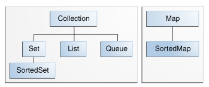

# Java Tech Interview

## Java Collection Framework

- Set : 데이터 중복을 허용하지 않고 순서가 없는 데이터의 집합
    - 구현클래스 : HashSet, TreeSet 등
- List : 데이터 중복을 허용하고 순서가 있는 데이터의 집합
    - 구현클래스 : ArrayList, LinkedList, Stack 등
- Map : 키(key)와 값(value) 쌍으로 이루어진 데이터의 집합, 키는 중복을 허용하지 않고 값을 중복을 허용
    - 구현클래스 : HashMap, TreeMap, HashTable 등
     
## 자바 기본형 정수와 Wrapper 클래스에 대한 차이는?
기본형 정수는 null이 불가능, Wrapper 클래스는 null 가능
Collection에서 기본형을 사용하려면 Wrapper 클래스를 사용해야 함

## 자바쓰레드 `start()`는 두번 호출 될 수 있는가?

될 수 없다. 두번 호출하면 IllegalThreadStateException() 이 발생한다.

## `static` 메소드를 오버라이드 할 수 있는가?

할 수 없다. JVM이 일반 메소드를 호출할 때 메소드 구현의 실체를 따라가 호출하지만 `static` 메소드를 호출할 경우 컴파일 시점에 선언된 타입을 호출하기 때문
 
## serialization 인터페이스에는 어떤 메소드가 있는가?
 
serialization 인터페이스는 메소드가 없다. 단지 직렬화 할 수 있다는 마커 인터페이스이기 때문

## `super()`와 `this()`의 차이?

`super()`는 super 클래스의 생성자를 호출, `this()`는 동일한 클래스의 생성자를 호출

## 메소드 overridden 방지법은 ?

메소드에 final 키워드를 선언하여 서브 클래스에 재정의를 막을 수 있음